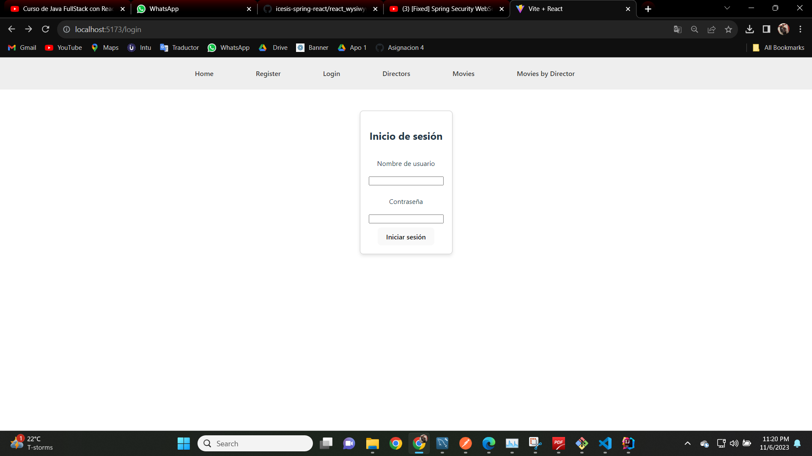
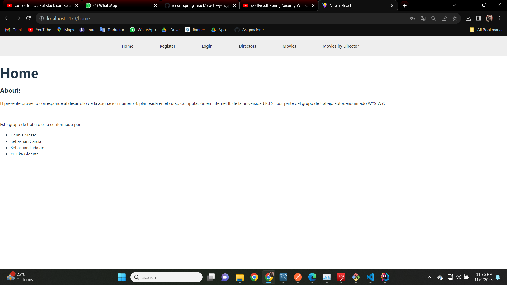
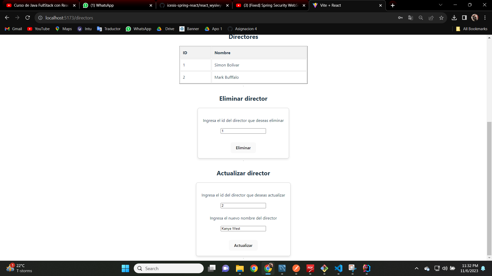
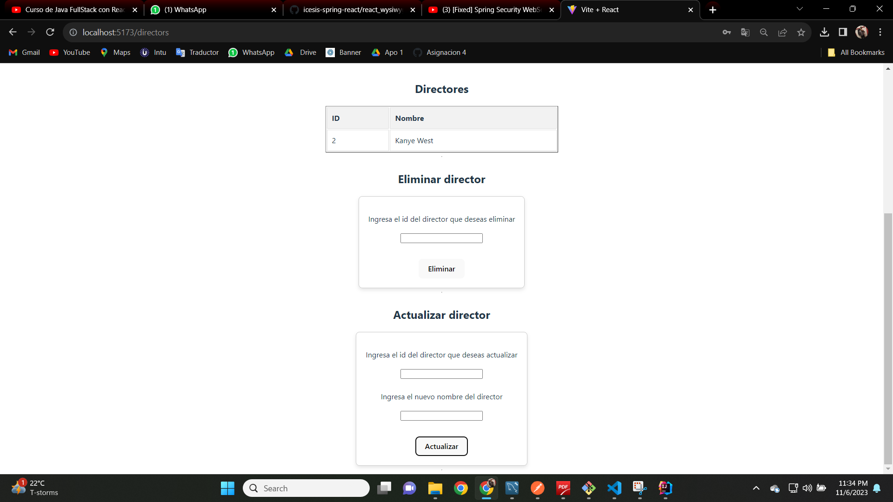
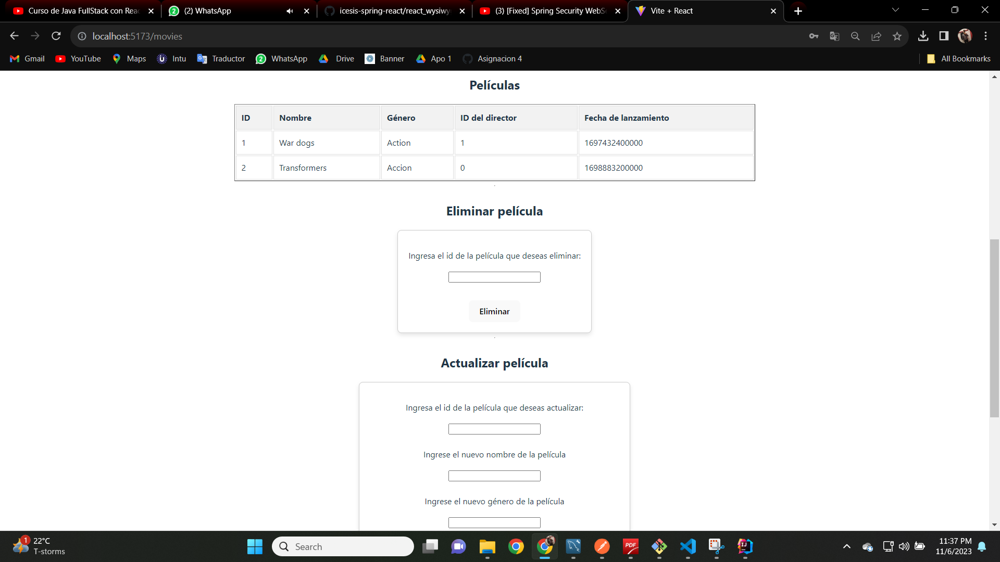
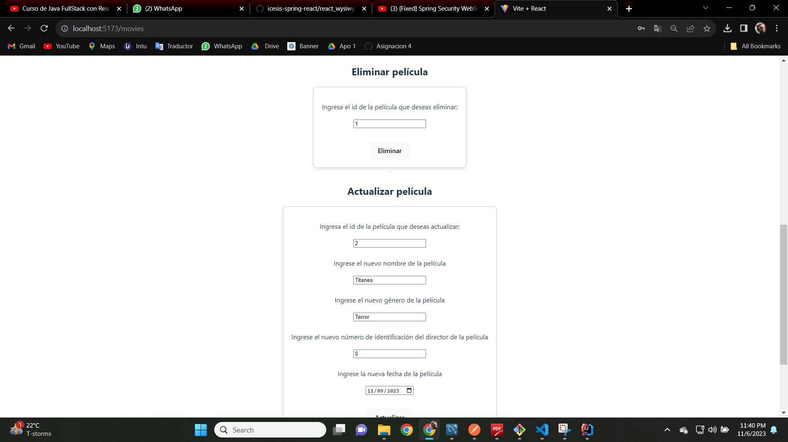
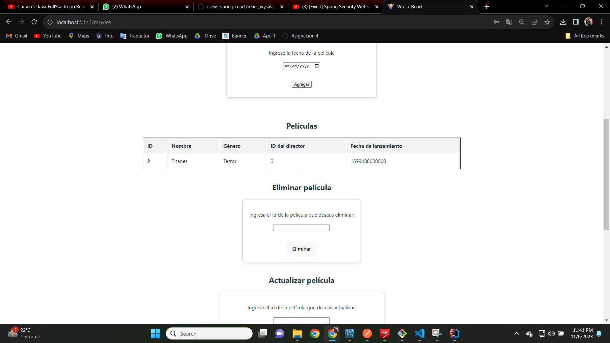

# react_wysiwyg

## About

Este repositorio tiene el fin de contener los archivos correspondientes a la asignación 4 del curso de Computación en Internet II.

---

## Integrantes

- Dennis Masso Macías
- Sebastián Hidalgo
- Sebastián García
- Yuluka Gigante Muriel

# INFORME

## Lo que se hizo

Cuando iniciamos la aplicacion, lo primero que nos envia es la pantalla del Login

Una vez logueados con cualquier usuario existente, Accedemos al menu Home.

Una vez aqui, podemos acceder a las demas funciones del codigo. Como por ejemplo registrar otro usuario del sistema.

Crear y ver los directores

Eliminar o Actualizar los existentes

Crear y ver peliculas existentes

O modificarlas y eliminarlas.

## Lo que falto por hacer.

El unico problema que tenemos es que en las fechas no se muestra correctamente la fecha indicada. Y quisieramos haberle puesto un mejor estilo 

## Las dificultades que tuvimos. 

Lo que nos entretuvo varias horas (Sino dias) fue la politica de CORS. Que con el JWT y la manera en la que lo implementamos, sumado a que estamos usando las ultimas version de Spring boot y Spring Security, nos dieron un verdadero quebradero de cabeza (el moni puede confirmar eso).

## Conclusiones. 

Como conclusion de este trabajo nos llevamos que la seguridad y el hacer un projecto no es una tarea sencilla. Requiere de mucho compromiso, investigacion y sobre todo comprension. 